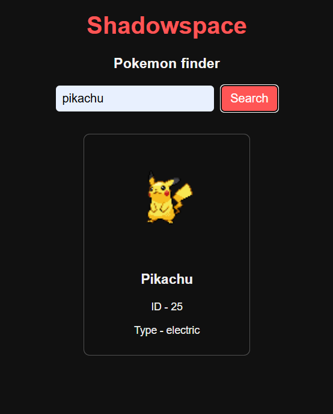

# Pokémon API App

A simple web application that lets users search for Pokémon by name or ID. This app uses the [PokéAPI](https://pokeapi.co/) to fetch and display basic details about each Pokémon, including their image, ID, name, and type.

## Demo



## Features

- **Search by Name or ID**: Users can enter a Pokémon’s name (like “pikachu”) or ID number (like “25”) to search for information.
- **Displays Pokémon Details**: Shows the Pokémon’s image, name, ID, and type(s) in a clean, card-based UI.
  
## Technologies Used

- **HTML**: Structure of the app.
- **CSS**: Styling and layout.
- **JavaScript**: Handling API requests and data display.
- **[PokéAPI](https://pokeapi.co/)**: A free Pokémon API for retrieving Pokémon data.

## Installation & Setup

1. **Clone the Repository**:
   ```bash
   git clone https://github.com/iamshadow.xyz/pokemon-finder.git
   cd pokemon-finder
   ```

2. **Open `index.html` in a Web Browser**:
   Simply open the `index.html` file in your preferred web browser to use the app.

No server setup is required—this is a static app that runs in the browser.

## Usage

1. **Search for a Pokémon**: Enter a Pokémon’s name (e.g., `bulbasaur`) or ID number (e.g., `1`) in the search box.
2. **View Results**: The app will display the Pokémon’s details (image, name, ID, and type) in a card format.
3. **Error Handling**: If the Pokémon is not found, an error message will be displayed.

## Code Overview

- **`index.html`**: Basic HTML structure and layout.
- **`styles.css`**: Contains styling for the app, including the card design for each Pokémon.
- **`script.js`**: Main JavaScript file. This file:
  - Fetches Pokémon data from the PokéAPI based on user input.
  - Displays Pokémon information in a card format.
  - Handles errors and invalid search inputs.

## Future Improvements

Some additional features that could enhance the app:

- **List Multiple Pokémon**: Display a list of Pokémon with pagination or infinite scroll.
- **Autocomplete Search**: Suggest Pokémon names as the user types.
- **Additional Pokémon Details**: Display more data like stats, abilities, and evolution.

Feel free to customize any parts of this README file based on any specific aspects of your project or additional features you plan to add.
